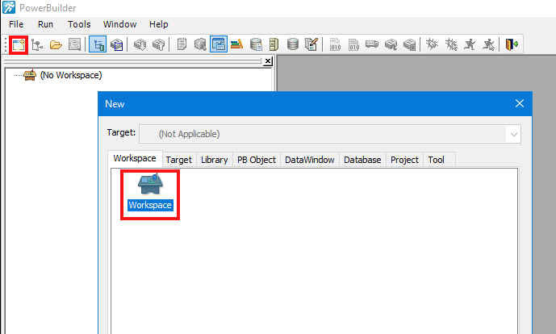
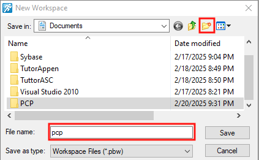
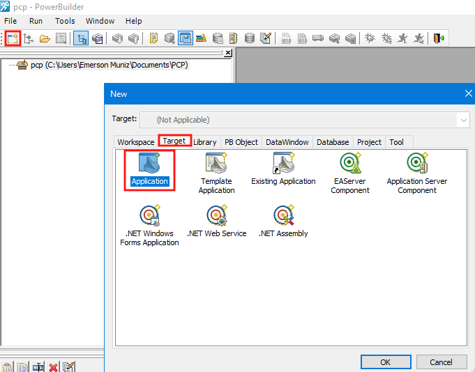
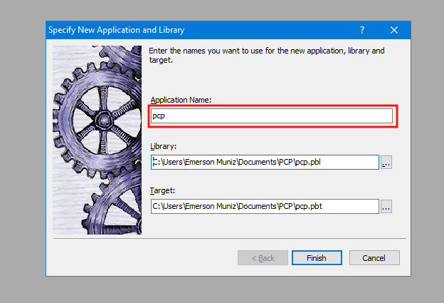

# TUTORIAL BÁSICO POWERBUILDER 12.5

## Introdução ao PowerBuilder

- - -

## Ambiente de Desenvolvimento

- - -

## Criando um Workspace

Antes de inciar o novo projeto, é necessário criar um workspace para estruturar e manter todos arquivos do projeto que são mantidos como bibliotecas internas, por exemplo uma biblioteca de janelas utilizadas.

File > New > Workspace > Workspace

Caso não tenha uma pasta especifica, neste momento pode criar uma ou escolher a pasta do projeto e dar o devido nome ao mesmo.

- - -

## Criando o objeto Aplicação

Após a criação do Workspace, é necessário criar o objeto aplicação

File > New > Target > Application

Entre com o nome para a aplicação, não vamos utilizar outra pasta ou nome para LIbrary ou Target neste projeto.

- - -

## Conexão com o Banco de Dados

- - -

## DataBase Painter

- - -

## DataWindown Painter

- - -

## Construindo Janelas

- - -

## Scripts

- - -

## Construindo o Menu

- - -

## Objetos de Usuário

- - -

## Distribuindo a Aplicação